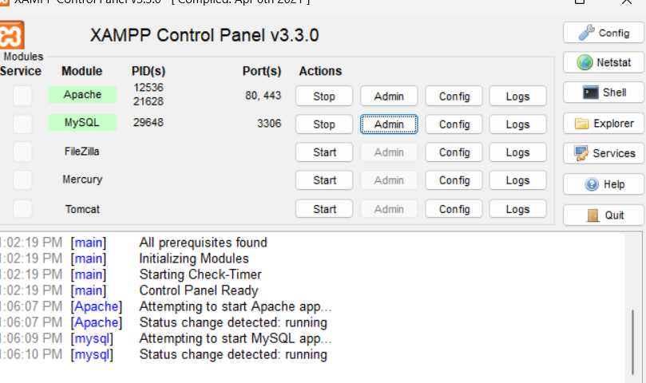
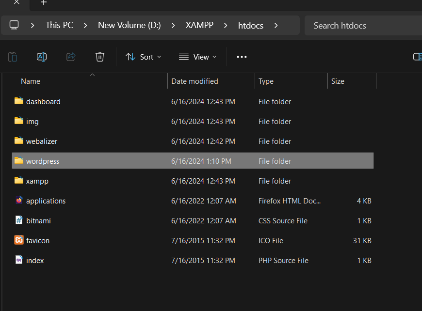
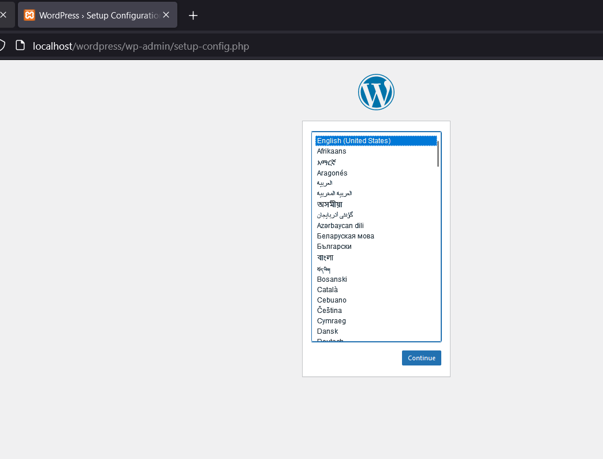
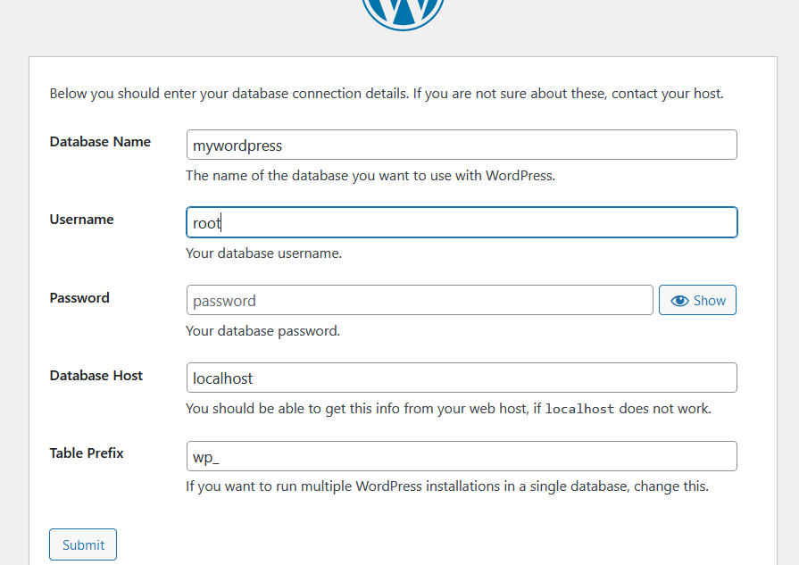
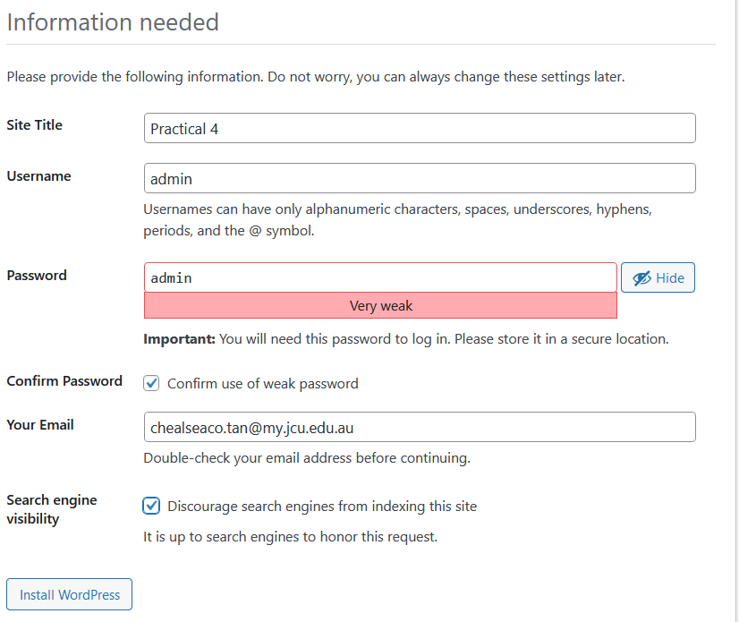
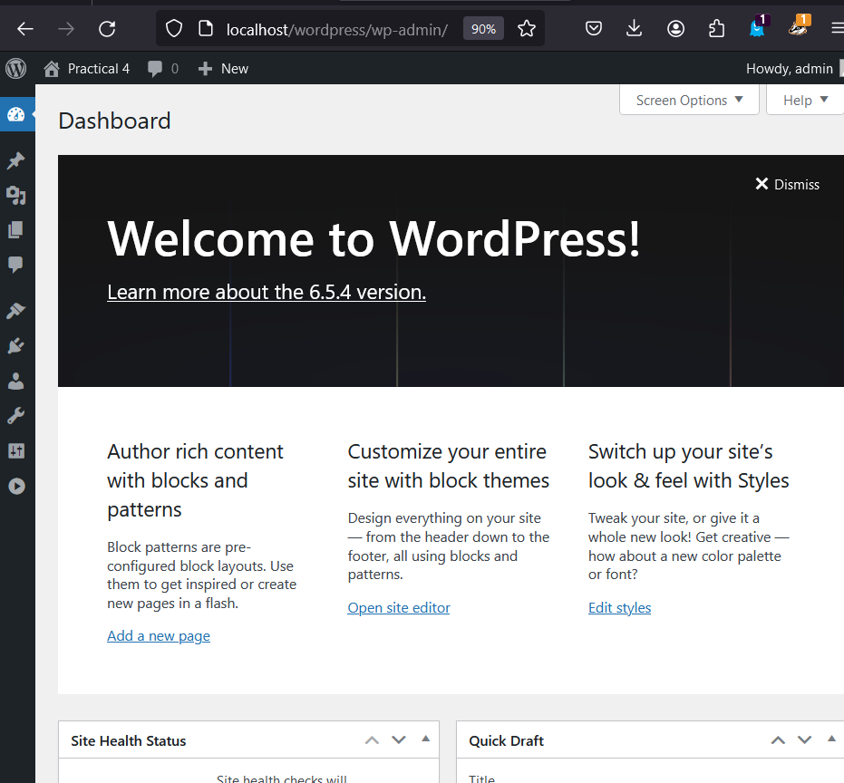
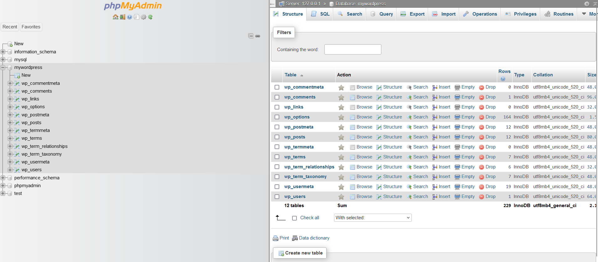
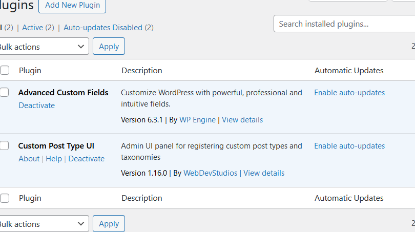
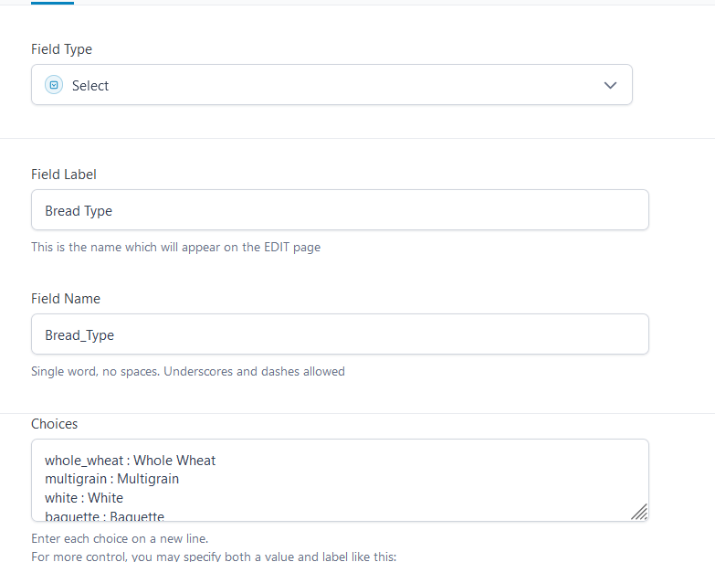

# Week 4 - Development and deployment workflows

## Learning Activities & Resources
In the fourth week of CP3402, Content Management System, I explored how to locally host a CMS, I picked WordPress for this practical that is the CMS I am more familiar with. My goal for this practical is to just familiarize with hosting and creating a database and not much on other WordPress features, since I would like to work more on my assignment.

For this to work, I had to install XAMPP to be able to host Word press locally. I used XAMPP since it is a free web server that consist of Apache that allows me to host websites on my local machine, MySQL/MariaDB for databases and contain interpreters for PHP and Perl programming languages. 

I will also use its phpMyAdmin tool to easily manage the databases locally without writing SQL commands manually. Allowing me to assess and develop websites files, databases, and codes without a live server. XAMPP can achieve this by creating a local host environment where I can access and assess my website.

I also used some plugins to help me further understand about creating new fields. Like, giving options for the user to select their breads for their bundle. Since, that is one of the options I was planning for my website. Either I create a bread box for them to choose or they customize their own box.

### Screenshot Steps for Practical:
Downloaded XAMPP and started running the Apache and MySQL.

Downloaded and extracted WordPress files into XAMPP’s htdocs folder.

Created a database name “mywordpress” using phpMyAdmin.

Successfully able to open WordPress setup in my localhost.

Enter “mywordpress” database information to connect it to the website.

Create website information.

Successfully created a WordPress localhost site.

Used these two plugins to create bread object fields to be able to use search option.

A sample of the bread field feature I did.

I did not finish till the search feature since I needed to plan on how to categorize the breads, but I was able to understand the gist of the feature.

### Assignment
Continued to explore the WordPress themes, plugin, and templates. So far, I can edit the content, but I am having a hard time making the website what I envisioned it to be. Some templates/themes have restrictions on how to edit the content, but I found a theme that I like, if it still does not work out, I might change the theme or editor.

### References
- [How to Install WordPress Locally on Windows for Beginners from Scratch](https://www.youtube.com/watch?v=usoJ6ckzUz8)
- [How to Build a Dynamic Website from Scratch with WordPress FOR FREE](https://www.youtube.com/watch?v=AmUD3GGs6-g)
- [How to Use XAMPP: A 3-Step Guide to Setting Up a Local WordPress Site](https://www.hostinger.com/tutorials/how-to-use-xampp-wordpress/)
- [How To Host a Website on Xampp Server](https://www.entrepreneurmakeover.com/how-to-host-a-website-on-xamp-server)

## Estimated Hours
Around 6 hours for practical, journaling and assignment

## Content Insights
Made me understand why we need a hosting platform to be able to view the WordPress locally. The WordPress download provided all the necessary links and files that allows me to use its options and features while the XAMPP enables me to see it live and access them. This is a great way to debug and run WordPress faster rather than using an online host to access WordPress. If I found a way to be able to make my local WordPress transfer to the current site host I am using, I might just edit my WordPress assignment locally first then upload it.

It made me realize that I should explore more on existing plugins that might make it easier for me to finish my assignment, or search more on best practices and formats to follow in creating an object, forms, etc. It could help me create websites in the future seamlessly than online, since I do not have to wait long for an action to take place, since it runs locally.

## Career/Employability/Learning Insights
Learning about local hosting could help me in the future if I wanted to make a career out of making websites. By creating it locally and putting it in my portfolio to display my skills or personally creating a website for an online business for myself or people I know who are interested to put their business online and I could offer my services.
